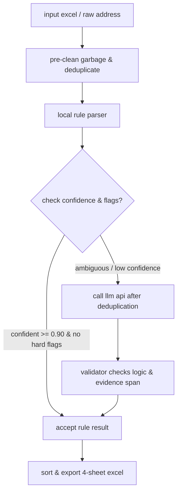

# supership address cleaner (`vn-address-cleaner`)

python library and cli for cleaning supership-style vietnamese delivery address excel files.

---

## 🚀 features

- **accurate address parsing**: splits raw address text into 6 clean columns: `poi` (point of interest/specific name), `tên đường` (street name), `cấp 4` (level 4 details like thôn/xóm/ấp/tổ dân phố...), `phường/xã` (ward), `quận/huyện` (district), and `tỉnh/tp` (province).
- **up-to-date administrative divisions (2025)**: automatically maps and updates addresses affected by the latest mergers or name changes in vietnam.
- **hybrid rule-llm model**: 
  - **80%–95% of rows**: processed instantly using the local rule parser, saving API costs and execution time.
  - **ambiguous/error rows**: fallback to LLM (Cerebras/Gemini) for deep semantic processing.
- **cost-efficient llm pipeline**: automatically deduplicates rows before calling the LLM API to minimize token usage.
- **robust cli**: supports sequential queue mode (`--queue-all`) for large files (thousands of rows) with pacing and retry mechanisms to handle rate limits.
- **local web ui**: upload multiple Excel files at once and download a consolidated, formatted spreadsheet.
- **professional excel output**: formatted with frozen panes, colored headers, auto-fit column widths, and natural sorting (Province → District → Ward), divided into 4 sheets:
  1. **địa chỉ sạch**: successfully cleaned addresses.
  2. **cần kiểm tra**: rows requiring manual review (low confidence, old/new mergers, LLM failures) with specific reasons.
  3. **dòng bị loại**: empty rows or rows where no level 4 details could be extracted.
  4. **thống kê**: general stats (total input, duplicates, success rate, review count).

---

## 🛠️ pipeline workflow



---

## 💻 installation

requires python 3.10 or newer.

### 1. install basic mode (rule-only)

```bash
cd /Users/dangkhoii/convert_adderss
python3 -m pip install -e .
```

### 2. install advanced mode (with llm support)

```bash
python3 -m pip install -e ".[llm]"
```

---

## 🔑 environment variables

if using the llm feature, create a `.env` file in the root directory or set the environment variables:

```env
CEREBRAS_API_KEY="your_api_key_here"

# advanced cerebras configurations (optional)
CEREBRAS_MODEL="gpt-oss-120b"
CEREBRAS_BATCH_SIZE=5
CEREBRAS_MAX_ROWS_PER_RUN=150
CEREBRAS_PACING_SEC=2.2
```

---

## 📖 cli usage

use the `vn-address-clean` command after installation or run the module directly:

### 1. basic run

clean a single excel file:
```bash
vn-address-clean input.xlsx -o output.xlsx
```

run without installing the console command:
```bash
python3 -m vn_address_cleaner.cli input.xlsx -o output.xlsx
```

### 2. advanced options

- **enable cerebras llm**:
  ```bash
  vn-address-clean input.xlsx -o output.xlsx --cerebras
  ```
- **sequential queue mode (large files)**:
  > [!TIP]
  > the `--queue-all` flag processes all ambiguous rows sequentially without limits, adjusting request rate (`CEREBRAS_PACING_SEC`) and retrying when rate-limited (HTTP 429).
  ```bash
  vn-address-clean input.xlsx -o output.xlsx --queue-all
  ```
- **keep empty/un-extracted rows**:
  ```bash
  vn-address-clean input.xlsx -o output.xlsx --include-empty-rows
  ```
- **keep results combined in a single row instead of splitting them**:
  ```bash
  vn-address-clean input.xlsx -o output.xlsx --combined-row
  ```
- **specify worksheet name**:
  ```bash
  vn-address-clean input.xlsx -o output.xlsx --sheet-name "Sheet1"
  ```

---

## 🐍 python library usage

### 1. clean a full excel file

```python
from vn_address_cleaner import clean_excel

# returns a CleanStats object containing processing statistics
stats = clean_excel(
    input_path="data/orders.xlsx",
    output_path="outputs/cleaned_orders.xlsx",
    use_cerebras=True,          # enable llm fallback for ambiguous rows
    split_components=True,      # split components into separate rows
)

print(stats.as_dict())
```

### 2. clean a single raw address

```python
from vn_address_cleaner import AddressCleaner

cleaner = AddressCleaner()

result = cleaner.clean(
    raw_address="Trường Cao Đẳng Cơ Giới Ninh Bình, Đường Vũ Duy Thanh, Tổ 2, Phường Yên Bình, Thành phố Tam Điệp, Ninh Bình",
    ward="Yên Bình",
    district="Tam Điệp",
    province="Ninh Bình",
)

# returns the output row as a list matching the excel columns
print(result.as_output_row())
# expected: ["Trường Cao Đẳng Cơ Giới Ninh Bình", "Đường Vũ Duy Thanh", "Tổ 2", "Phường Yên Bình", "Thành phố Tam Điệp", "Tỉnh Ninh Bình"]
```

---

## 🖥️ local web ui

run the local web server:

```bash
python3 address_ui.py
```

then open in your browser:
```text
http://127.0.0.1:8899
```

> [!NOTE]
> when uploading multiple files together, the ui downloads one consolidated `cleaned_address_files.xlsx`. each sheet includes a `Tên file nguồn` column so rows from different uploads remain distinguishable.

---

## 🧪 testing

run tests to verify parsing rules and llm integration:

```bash
python3 -m unittest discover -s scratch -p 'test*.py'
```

---

## 🔒 privacy

> [!CAUTION]
> never commit actual customer order files, generated outputs, local sqlite databases (`cache_diachi.sqlite`), or sensitive files to public git branches. verify your `.gitignore` before pushing.
